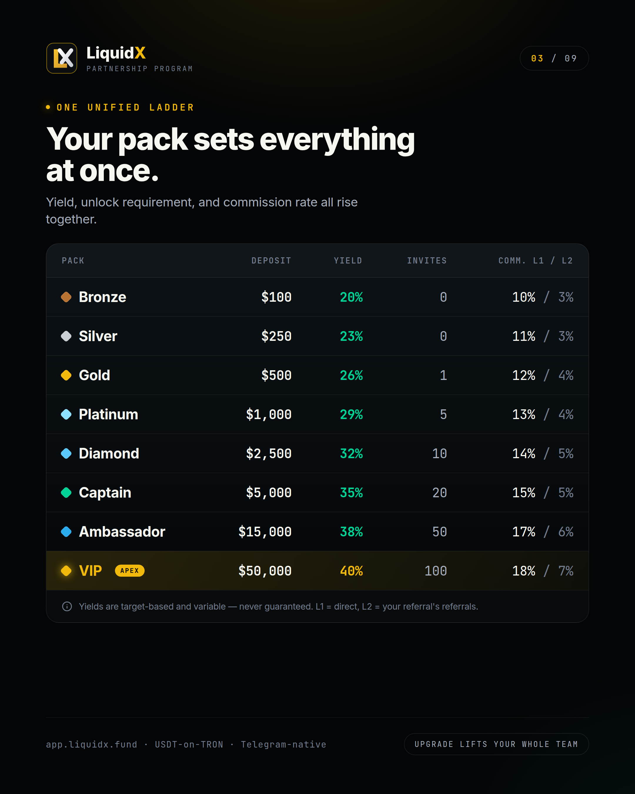
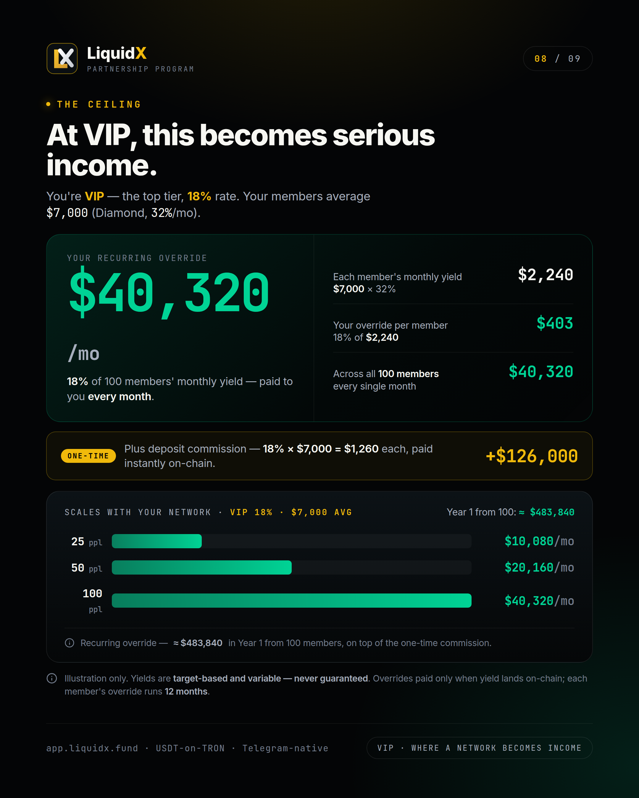
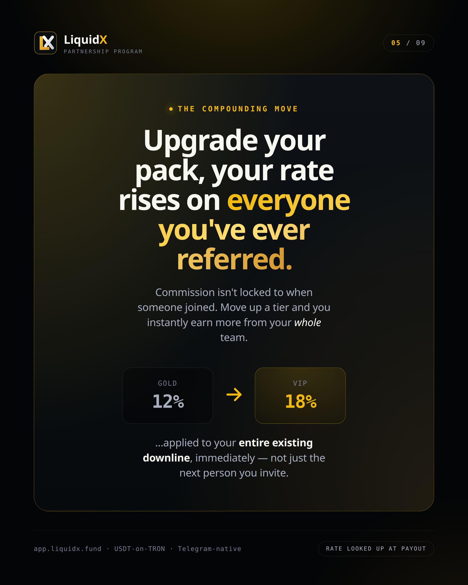
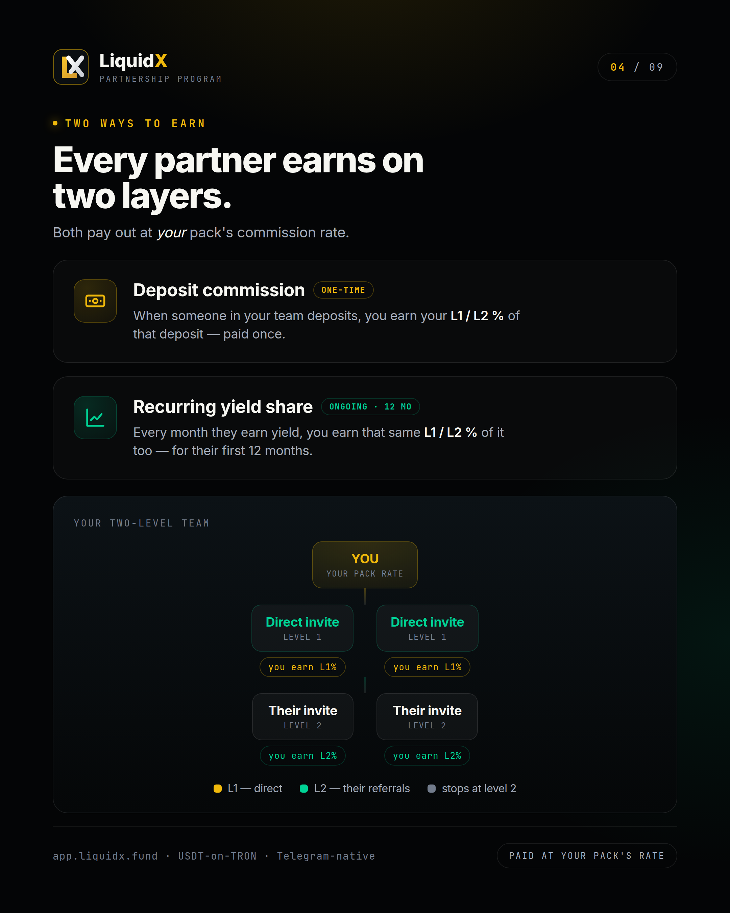

# Liquidity Captains

The top three tiers of the LiquidX Partnership Program — **Captain**, **Ambassador**, and **VIP** — form the network's core builder layer.

These are not just high-yield deposit positions. They carry responsibility: a minimum number of active invited members is required to unlock and maintain each tier. Partners at these levels are the people who build communities, educate members, and grow the network with integrity.

---

## The three upper tiers

<figure><figcaption>Captain, Ambassador, and VIP are the top three tiers. Higher deposit, higher yield, higher commission, more required invites.</figcaption></figure>

| Tier | Deposit | Monthly yield (target) | Invites required | Commission L1 / L2 |
|---|---|---|---|---|
| Captain | $5,000 | 35% / mo | 20 active members | 15% / 5% |
| Ambassador | $15,000 | 38% / mo | 50 active members | 17% / 6% |
| VIP (Apex) | $50,000 | 40% / mo | 100 active members | 18% / 7% |

> "Invites required" means active members who have deposited and funded a pack through your invite link — not just signups.

---

## Captain — $5,000 · 35% · 20 members

The Captain tier is the first upper-tier position. It marks the transition from solo investor to active network builder.

**To unlock Captain:**
- Hold a $5,000 pack (or equivalent).
- Have at least 20 active members in your Level 1 + Level 2 network.

**What you earn:**
- 35% monthly yield (target) on your own $5,000.
- 15% commission on every direct member's deposit (L1, one-time).
- 5% commission on every L2 member's deposit (one-time).
- 15% of every L1 member's monthly yield — for their first 12 months.
- 5% of every L2 member's monthly yield — for their first 12 months.

**At scale — Captain, 20 members averaging $1,000 (Platinum at 29%/mo):**

| Event | Your earnings |
|---|---|
| 20 deposits of $1,000 | $3,000 commission (15% × $1,000 × 20) |
| Monthly yield share (20 × $290 × 15%) | $870 / month |
| 12-month yield share total | ~$10,440 |

---

## Ambassador — $15,000 · 38% · 50 members

The Ambassador tier is for serious network builders with a proven team and high capital allocation. At this level, the compounding effect of yield share across 50+ members becomes significant.

**To unlock Ambassador:**
- Hold a $15,000 pack (or equivalent).
- Have at least 50 active members across your network.

**What you earn:**
- 38% monthly yield (target) on your own $15,000.
- 17% commission on every L1 deposit (one-time).
- 6% commission on every L2 deposit (one-time).
- 17% of every L1 member's monthly yield — for their first 12 months.
- 6% of every L2 member's monthly yield — for their first 12 months.

**At scale — Ambassador, 50 members averaging $2,500 (Diamond at 32%/mo):**

| Event | Your earnings |
|---|---|
| 50 deposits of $2,500 | $21,250 commission (17% × $2,500 × 50) |
| Monthly yield share (50 × $800 × 17%) | $6,800 / month |
| 12-month yield share total | ~$81,600 |

---

## VIP (Apex) — $50,000 · 40% · 100 members

VIP is the top tier. It carries the highest yield rate on personal capital, the highest commission rates across both levels, and the largest active network requirement.

**To unlock VIP:**
- Hold a $50,000 pack (or equivalent).
- Have at least 100 active members across your network.

**What you earn:**
- 40% monthly yield (target) on your own $50,000.
- 18% commission on every L1 deposit (one-time).
- 7% commission on every L2 deposit (one-time).
- 18% of every L1 member's monthly yield — for their first 12 months.
- 7% of every L2 member's monthly yield — for their first 12 months.

<figure><figcaption>VIP at 18%. 100 members averaging $7,000 (Diamond, 32%/mo) = $40,320/mo in recurring yield share, plus $126,000 in deposit commission.</figcaption></figure>

**At scale — VIP, 100 members averaging $7,000 (Diamond at 32%/mo):**

| Event | Your earnings |
|---|---|
| 100 deposits of $7,000 | $126,000 commission (18% × $7,000 × 100) |
| Monthly yield share (100 × $2,240 × 18%) | $40,320 / month |
| Year 1 yield share total | ~$483,840 |

---

## The upgrade effect

When you upgrade from Captain to Ambassador to VIP, your higher commission rate applies immediately to your entire existing team — not just members added after the upgrade.

<figure><figcaption>Commission rates are looked up at payout time. Upgrading your pack retroactively benefits every member in your downline.</figcaption></figure>

**Example:** You are Captain (15%) with 30 team members. You upgrade to Ambassador (17%). From the next payout cycle, you earn 17% on all 30 existing members. You do not need to rebuild your network to benefit from the rate increase.

This makes early team-building and staged upgrades the most effective path to growing your override income.

---

## Responsibilities at the upper tiers

Partners at Captain, Ambassador, and VIP level represent LiquidX to a significant number of people. With that comes a higher standard of conduct.

**What upper-tier partners do:**

* Educate members on how LiquidX works — deposits, packs, yield variability, withdrawal rules, and risk.
* Run accurate onboarding — no inflated earnings claims, no fake screenshots.
* Build retention by helping members understand what they are in and what to expect.
* Direct members to the official bot for support — not to personal DMs.
* Report suspicious activity, fake account patterns, or fraud attempts.

**Messaging standards — what you must not say:**

* "Guaranteed yield" or "fixed monthly profit."
* "No risk" or "no loss possible."
* "Passive income guaranteed."
* "Double your money."
* Any earnings claim that is not qualified with the variable/target-based disclaimer.

**What you should say:**

* LiquidX is a Telegram-native liquidity access platform.
* Yield is target-based and variable — performance changes monthly.
* Capital is at risk. Members should only allocate what they can afford to lose.
* No return is guaranteed. Read the docs before depositing.

---

## How the two earning layers work at Captain+

<figure><figcaption>Both the deposit commission and the recurring yield share are paid at your pack's rate — L1 for direct invites, L2 for their referrals.</figcaption></figure>

At every upper tier, you earn on two distinct events for every member:

1. **When they deposit** — you receive your L1 or L2 percentage of their deposit, once, immediately on-chain.
2. **Every month they earn yield** — you receive that same percentage of their yield, recurring, for 12 months.

At Captain, a single member who deposits $5,000 and earns 35%/mo generates:
- $750 on deposit (15% × $5,000)
- $262.50/mo in yield share (15% × $1,750)
- ~$3,150 in yield share over 12 months
- Total from one member: ~$3,900

---

## Getting to Captain and beyond

**Path from Bronze to Captain:**

1. Start with $100 Bronze. Learn the platform, earn your referral link.
2. Invite your first qualified member (Gold requires 1). Earn your first deposit commission.
3. Scale to Platinum ($1,000) — requires 5 active members. Commission rises to 13%.
4. Scale to Diamond ($2,500) — requires 10 members. Commission rises to 14%.
5. Captain ($5,000) — requires 20 active members. Commission rises to 15%.

Each upgrade increases both your personal yield rate and your commission rate on your entire existing downline. The math compounds with each step.

---

## Start building

Open the Telegram mini-app, activate your pack, and go to the **Referral** tab for your personal invite link.

Official access: **[@LiquidX_official_bot](https://t.me/LiquidX_official_bot)**

See [Partnership Program](referral-program.md) for the full commission structure and worked examples.

---

*Capital at risk. All yield and commission figures are target-based, variable, and not guaranteed. Figures shown are illustrative only and depend on actual yields being realised on-chain. Early-exit fee: 50% in month 1, 10% after. Yield-share window: 12 months per downline member. Not financial advice. Official bot: [@LiquidX\_official\_bot](https://t.me/LiquidX_official_bot)*
