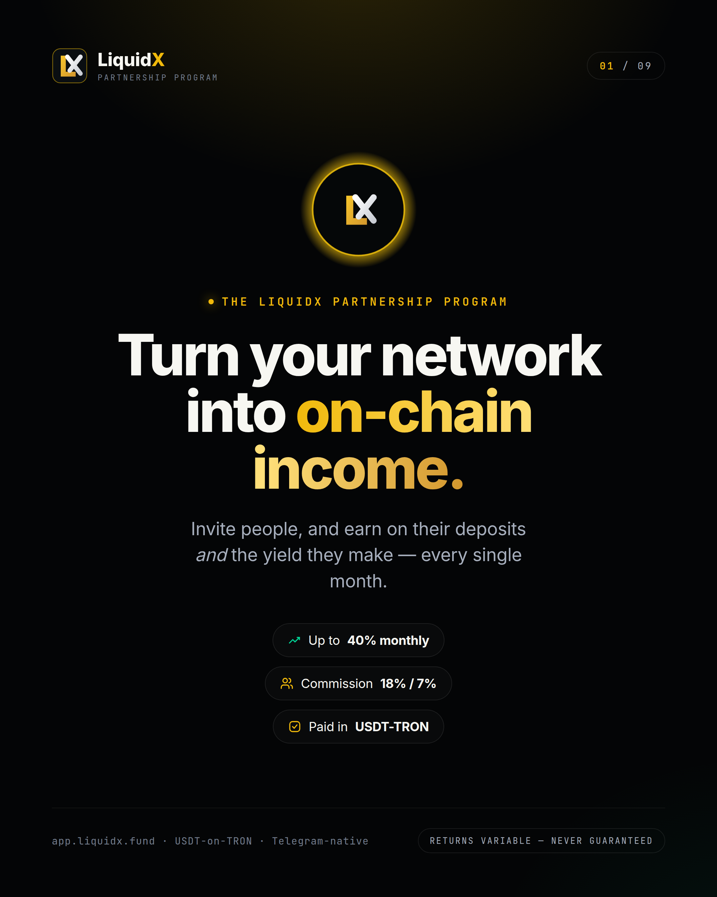
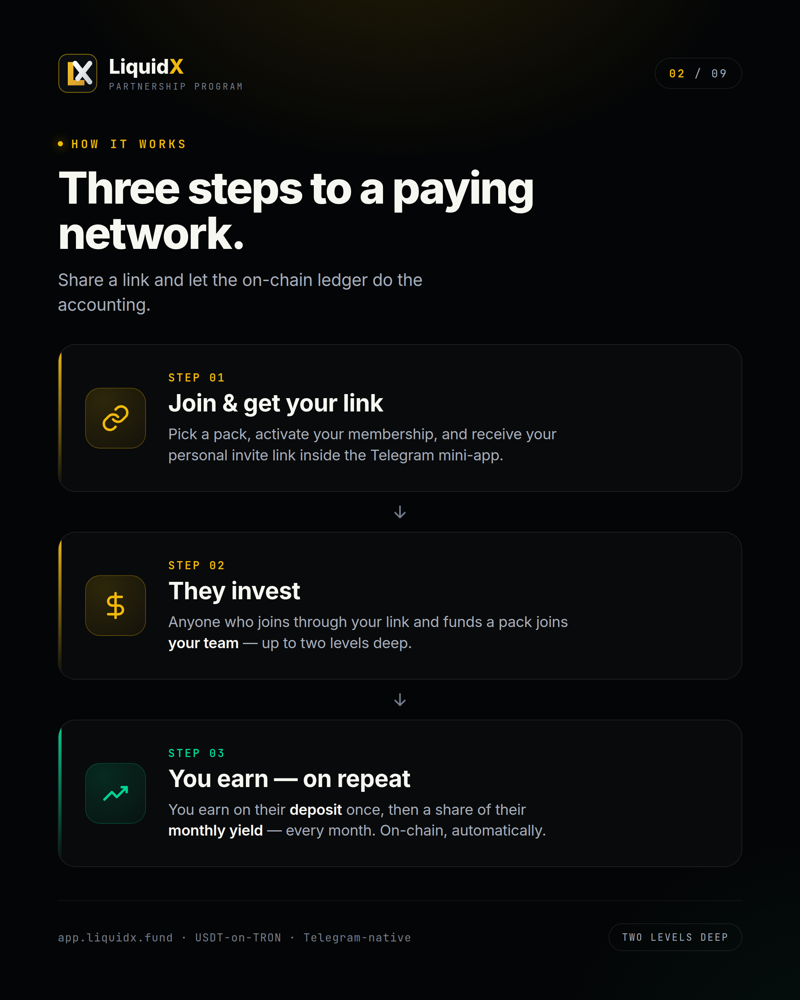
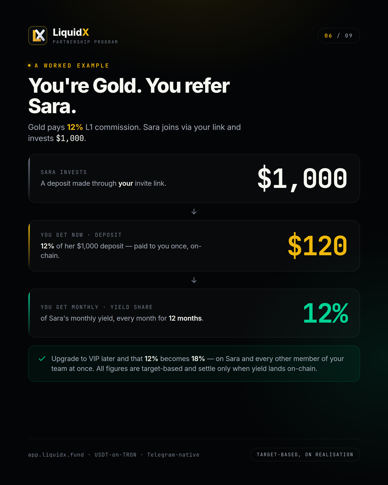
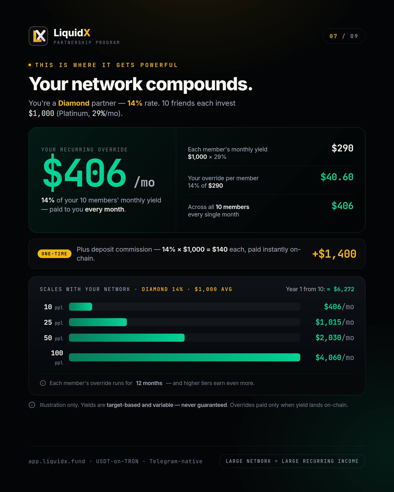
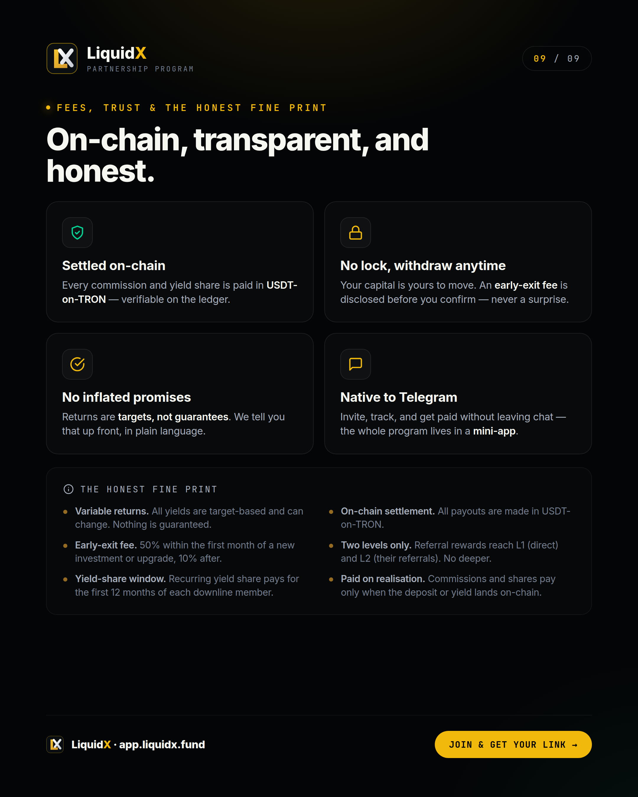

# Partnership Program

Turn your network into on-chain income.

Every LiquidX member receives a personal invite link the moment they activate a pack. Share that link — and you earn on every deposit *and* every month of yield your team generates, automatically, on-chain, in USDT.

<figure><figcaption>Up to 40% monthly yield on your own capital. Up to 18% / 7% commission on your team's deposits and yield.</figcaption></figure>

---

## How it works — three steps

<figure><figcaption>Share a link and let the on-chain ledger do the accounting.</figcaption></figure>

**Step 1 — Join and get your link**\
Pick a pack, activate your membership, and receive your personal invite link inside the Telegram mini-app.

**Step 2 — They invest**\
Anyone who joins through your link and funds a pack joins your team — up to two levels deep.

**Step 3 — You earn, on repeat**\
You earn on their deposit once, then a share of their monthly yield — every month, on-chain, automatically.

---

## The commission ladder

Your pack sets your yield rate, your commission rate, and your network unlock threshold — all at once. As you upgrade, everything rises together.

<figure><figcaption>Yield, unlock requirement, and commission rate all rise together as you move up.</figcaption></figure>

| Pack | Deposit | Yield (target) | Invites required | Commission L1 / L2 |
|---|---|---|---|---|
| Bronze | $100 | 20% / mo | 0 | 10% / 3% |
| Silver | $250 | 23% / mo | 0 | 11% / 3% |
| Gold | $500 | 26% / mo | 1 | 12% / 4% |
| Platinum | $1,000 | 29% / mo | 5 | 13% / 4% |
| Diamond | $2,500 | 32% / mo | 10 | 14% / 5% |
| Captain | $5,000 | 35% / mo | 20 | 15% / 5% |
| Ambassador | $15,000 | 38% / mo | 50 | 17% / 6% |
| VIP (Apex) | $50,000 | 40% / mo | 100 | 18% / 7% |

> Yields are target-based and variable — never guaranteed. L1 = your direct invites. L2 = their referrals.

---

## Two ways to earn on every person you invite

Every partner earns on two layers — and both pay at your pack's commission rate.

<figure><figcaption>Deposit commission is paid once. Yield share is paid monthly for 12 months — both at your pack rate.</figcaption></figure>

### 1. Deposit commission (one-time)

When someone in your team deposits, you earn your L1 or L2 percentage of that deposit — paid once, on-chain, the moment it settles.

### 2. Recurring yield share (ongoing · 12 months)

Every month your team members earn yield, you earn that same L1 or L2 percentage of their yield — for their first 12 months on the platform.

Your team is two levels deep:

* **Level 1** — people you invited directly. You earn L1% on their deposits and yield.
* **Level 2** — people your Level 1 members invited. You earn L2% on their deposits and yield.
* The chain stops at Level 2. No deeper.

---

## The upgrade effect — your rate rises on everyone

Upgrading your pack does not just increase your rate on future referrals. It increases your rate on every team member you have ever referred — immediately.

<figure><figcaption>Commission rates are looked up at the time of payout, not at the time of the referral. Upgrading retroactively benefits your entire downline.</figcaption></figure>

**Example:** You joined at Gold (12% L1). You build a team of 30 people. You then upgrade to VIP (18% L1). From the next payout cycle, you earn 18% on all 30 members — not just new ones added after the upgrade.

This makes early network-building and later pack upgrades a compounding combination.

---

## Worked example — Gold tier, one referral

<figure><figcaption>Gold pays 12% L1. Sara invests $1,000. You earn $120 on deposit, then 12% of her yield every month for 12 months.</figcaption></figure>

You are Gold. You invite Sara. Sara joins via your link and invests **$1,000**.

| Event | Your earnings |
|---|---|
| Sara's deposit lands on-chain | **$120** (12% of $1,000, one-time) |
| Month 1: Sara earns 29% yield ($290) | **$34.80** (12% of $290) |
| Month 2: same | **$34.80** |
| … every month for 12 months | **$34.80 / mo** |
| If you upgrade to VIP before any payout | Rate rises to **18%** on Sara — retroactively |

From one referral at Gold, you earn $120 on day one and up to $417.60 in yield share over 12 months — for a total of ~$537 from a single invite, before any upgrade.

---

## How a network compounds — Diamond example

<figure><figcaption>Diamond at 14% rate. 10 members each at $1,000 (Platinum, 29%/mo) = $406/mo recurring override, plus $1,400 on their deposits.</figcaption></figure>

You are Diamond (14% rate). You have 10 members, each with a Platinum pack ($1,000 at 29%/mo).

**Monthly recurring override:**

* Each member earns $290/mo (29% of $1,000)
* Your share: 14% of $290 = **$40.60 per member**
* Across 10 members: **$406 / month**

**One-time deposit commission:**

* 14% × $1,000 × 10 members = **$1,400** (paid on each deposit)

**How it scales at Diamond 14%, $1,000 average deposit:**

| Network size | Monthly override |
|---|---|
| 10 people | $406 / mo |
| 25 people | $1,015 / mo |
| 50 people | $2,030 / mo |
| 100 people | $4,060 / mo |

Year 1 total from 10 members: ≈ **$6,272**

---

## The VIP ceiling — serious recurring income

<figure><figcaption>VIP at 18%. 100 members averaging $7,000 (Diamond, 32%/mo) = $40,320/mo recurring + $126,000 in deposit commission.</figcaption></figure>

You are VIP (18% rate). Your 100 members average a $7,000 Diamond pack (32%/mo).

**Monthly recurring override:**

* Each member earns $2,240/mo (32% of $7,000)
* Your share: 18% of $2,240 = **$403 per member**
* Across 100 members: **$40,320 / month**

**One-time deposit commission:**

* 18% × $7,000 × 100 members = **$126,000**

**How it scales at VIP 18%, $7,000 average deposit:**

| Network size | Monthly override |
|---|---|
| 25 people | $10,080 / mo |
| 50 people | $20,160 / mo |
| 100 people | $40,320 / mo |

Year 1 total from 100 members: ≈ **$483,840**

> Illustration only. Yields are target-based and variable — never guaranteed. Overrides paid only when yield lands on-chain. Each member's override runs 12 months.

---

## Trust, fees, and the honest fine print

<figure><figcaption>All commissions settle in USDT-on-TRON. No hidden fees. No lock period — but early-exit fees apply.</figcaption></figure>

**Settled on-chain.** Every commission and yield share is paid in USDT-on-TRON, verifiable on the ledger.

**No lock — withdraw anytime.** Your capital is yours to move. An early-exit fee is disclosed before you confirm — never a surprise.

**No inflated promises.** Returns are targets, not guarantees. LiquidX states this clearly and upfront.

**Native to Telegram.** Invite, track, and get paid without leaving chat — the entire program lives in the mini-app.

### The fine print

| Term | Detail |
|---|---|
| Yields | Target-based and variable. Nothing is guaranteed. |
| Early-exit fee | 50% within the first month of a new investment or upgrade. 10% after. |
| Yield-share window | Recurring yield share runs for the first 12 months of each downline member's activity. |
| Settlement currency | USDT-on-TRON |
| Network depth | Two levels only. L1 = direct. L2 = their referrals. Stops there. |
| Payment trigger | Commissions and shares settle only when the underlying deposit or yield lands on-chain. |

---

## What referrers must not do

* Promise guaranteed returns or fixed monthly profit.
* Claim there is no risk.
* Use fake screenshots, fabricated earnings, or inflated projections.
* Spam Telegram groups or DM users unsolicited.
* Pressure users into depositing money they cannot afford to lose.
* Impersonate LiquidX support.
* Create fake accounts or use bots.

Violating these standards may result in removal from the program and forfeiture of pending rewards.

---

## Get started

1. Open the official LiquidX Telegram app: **[@LiquidX_official_bot](https://t.me/LiquidX_official_bot)**
2. Activate a pack (minimum $100 — Bronze).
3. Go to the **Referral** tab and copy your personal invite link.
4. Share it. Earn on every deposit and every month of yield.

See [Liquidity Captains](liquidity-captains.md) for the Captain, Ambassador, and VIP tier breakdown.

---

*Capital at risk. All yield figures are targets — variable and not guaranteed. Commission figures shown are illustrative only and depend on actual yields being realised on-chain. Early-exit fees apply. Not financial advice. Official bot: [@LiquidX\_official\_bot](https://t.me/LiquidX_official_bot)*
