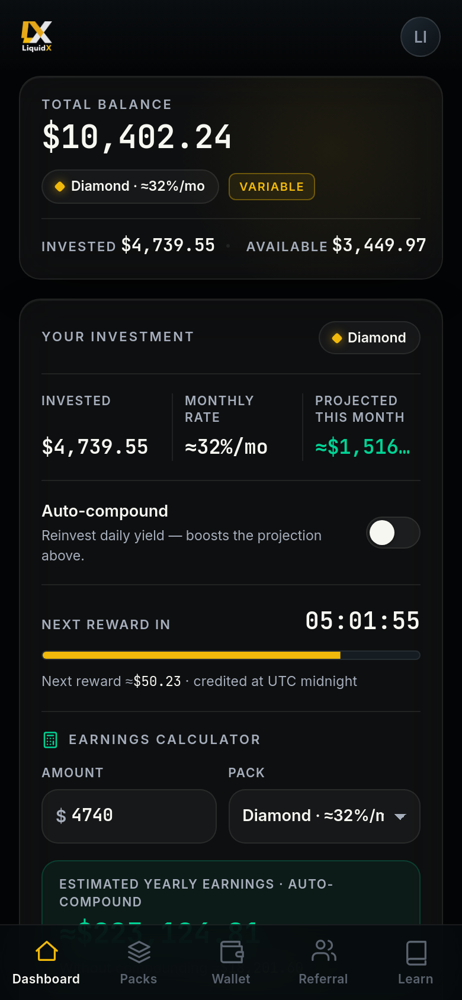

---
cover: ../.gitbook/assets/gitbook-cover.png
coverY: 0
---

# Dashboard

The LiquidX dashboard is the user's main tracking surface.

It is designed to show what the user has deposited, which pack is active, how allocation is progressing, what projections are visible, and whether referral or withdrawal activity is pending.

<figure><figcaption>LiquidX dashboard — balance, allocation status, projections and referral rewards in one view.</figcaption></figure>

## Core dashboard items

The dashboard should help users track:

* Account status.
* Deposit history.
* Selected pack.
* Allocation status.
* Current balance.
* Projected performance.
* Activity or fee updates.
* Referral rewards.
* Withdrawal requests.
* Security or risk notices.

## Projections

Projected performance is shown for transparency.

It helps users understand possible outcomes based on current assumptions, pack rules, liquidity demand, OTC flow, market activity, vault performance, and risk conditions.

Projection does not mean promise. Actual performance may be lower, delayed, or negative.

## Activity tracking

Activity tracking may show how a user's allocation is being handled at a high level.

Depending on product design, activity may relate to liquidity routes, pools, vaults, OTC-related flow, market-making operations, stablecoin movement, or internal balancing.

LiquidX should avoid presenting activity in a way that suggests guaranteed yield or certainty.

## Referral tracking

The dashboard may show referral activity such as:

* Invited users.
* Qualified users.
* Referral deposits.
* Pending rewards.
* Paid rewards.
* Campaign or captain status.

Referral rewards depend on real user behavior and real deposit activity.

## Withdrawal tracking

The dashboard should show withdrawal status clearly, including whether a request is pending, processing, completed, rejected, delayed, or awaiting additional checks.

Withdrawals may depend on pack rules, lock periods, vault cycles, liquidity availability, processing windows, security review, and network conditions.

## Why transparency matters

LiquidX is education-first. A good dashboard should reduce confusion, not create hype.

Users should be able to understand their position, see important risk information, and make decisions without relying on private promises from referrers or community members.

---

> **Risk notice:** LiquidX does not guarantee returns. Performance is variable. Capital is at risk. Dashboard projections and monthly targets are illustrative, not promises. Nothing in this documentation is financial advice. Use only the official LiquidX bot: **[@LiquidX_official_bot](https://t.me/LiquidX_official_bot)**.
