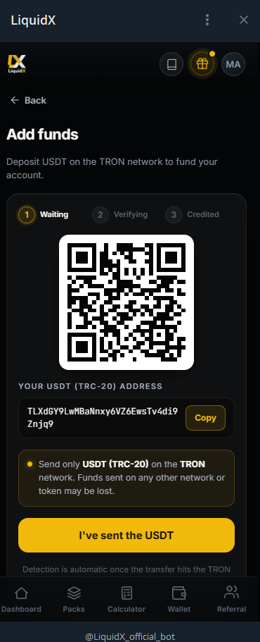

---
cover: ../.gitbook/assets/gitbook-cover.png
coverY: 0
---

# Deposits

Deposits are the first funding step in LiquidX.

Users deposit USDT through the official Telegram Mini App, wait for confirmation, choose a pack, and then allocation can begin.

<figure><figcaption>The Add Funds screen — your personal USDT (TRC-20) deposit address with QR code, ready to receive funds.</figcaption></figure>

## How deposits work — step by step

When you tap **+ Deposit** in the Wallet, the app shows:

* Your personal **USDT (TRC-20) address** on the TRON network.
* A **QR code** you can scan directly from your exchange or wallet.
* A **Copy** button to paste the address securely.
* A 3-step status tracker: **Waiting → Verifying → Credited**.

Once you send USDT from your exchange or wallet:

1. The app waits for the transaction to hit the TRON network.
2. Detection is **automatic** — no need to paste a hash or contact support.
3. Once verified, funds appear as **Available** in your Wallet.

> **Important:** Send only **USDT (TRC-20)** on the **TRON network**. Funds sent on any other network or token may be lost permanently.

## Before depositing

Always verify:

* You are using the official bot: **[@LiquidX_official_bot](https://t.me/LiquidX_official_bot)**.
* The deposit address is shown inside the official app.
* The network is supported.
* The amount is correct.
* You understand the pack rules, withdrawal rules, and risk notice.

Do not send funds based on a private message, unofficial group link, screenshot, or copied address from another user.

## Deposit flow

The typical deposit flow is:

1. Open the official LiquidX Telegram Mini App.
2. Choose the deposit option.
3. Select or confirm the supported USDT network.
4. Copy the deposit address from the official interface.
5. Send USDT from your wallet or exchange.
6. Wait for blockchain confirmations and internal checks.
7. Confirm that the dashboard updates.
8. Choose a pack.
9. Allocation starts according to product rules.

## Confirmation timing

Deposits may not appear instantly.

Timing can depend on:

* Blockchain congestion.
* Exchange withdrawal speed.
* Network confirmations.
* Internal security checks.
* Incorrect network or address usage.
* Manual review for unusual activity.

If a deposit is delayed, users should contact support through the official app and provide the transaction details requested by the support flow.

## Deposit risk

Crypto transfers can be irreversible. Sending USDT to the wrong address, wrong network, or unofficial wallet can lead to permanent loss.

LiquidX does not control blockchain network conditions, exchange withdrawal delays, or user wallet mistakes.

---

*Capital at risk. Performance variable. Not financial advice. Official bot: [@LiquidX_official_bot](https://t.me/LiquidX_official_bot)*
