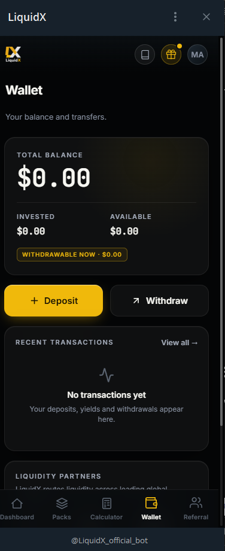

# Wallet

The Wallet is your financial hub inside LiquidX.

It shows your total balance, what is actively invested, what is available, and what you can withdraw right now. Every deposit and every withdrawal goes through this screen.

<figure><figcaption>The LiquidX Wallet — your balance, invested capital, available funds, and recent transactions in one place.</figcaption></figure>

## What the Wallet shows

| Field | What it means |
|---|---|
| **Total Balance** | Your full balance (invested + available) |
| **Invested** | Capital currently allocated in a pack |
| **Available** | Funds ready to be used or withdrawn |
| **Withdrawable Now** | Amount you can request to withdraw today |
| **Recent Transactions** | Your deposits, yields, and withdrawals history |

## Two actions, always visible

From the Wallet screen, two buttons are always available:

* **+ Deposit** — Add USDT to your account at any time.
* **Withdraw** — Request a withdrawal at any time.

LiquidX is designed to work like a professional platform: you are always in control of initiating a deposit or withdrawal. There are no hidden locks on access to the interface.

## Transparency by design

The Wallet is built to reduce uncertainty.

Users should always be able to see:

* Exactly how much they have deposited.
* How much is currently invested.
* How much is available.
* How much they can request to withdraw.
* Their full transaction history.

This visibility is a core part of how LiquidX builds trust with its users.

## How to access the Wallet

Open the official bot: **[@LiquidX\_official\_bot](https://t.me/LiquidX_official_bot)**

Navigate to the **Wallet** tab at the bottom of the Mini App. The Wallet tab is always accessible from any screen.

---

*Capital at risk. Performance variable. Not financial advice. Official bot: [@LiquidX_official_bot](https://t.me/LiquidX_official_bot)*
