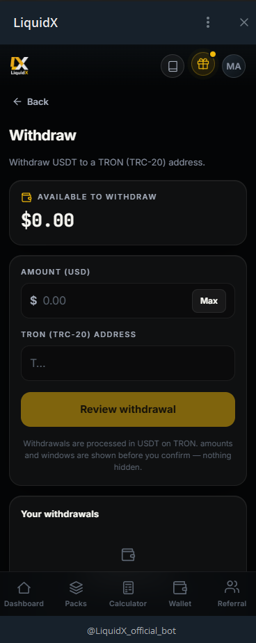

---
cover: ../.gitbook/assets/gitbook-cover.png
coverY: 0
---

# Withdrawals

Users can request a withdrawal at any time, directly from the Wallet tab inside the LiquidX Telegram app.

The process is transparent: your available balance, the amount, and all conditions are shown before you confirm — nothing is hidden.

<figure><figcaption>The Withdraw screen — available balance shown upfront, amount input, TRON address field, and a review step before anything is sent.</figcaption></figure>

## How withdrawals work — step by step

When you tap **Withdraw** in the Wallet:

1. The app shows your **Available to Withdraw** balance clearly at the top.
2. Enter an **Amount (USD)** — or tap **Max** to request your full available balance.
3. Paste your **TRON (TRC-20) destination address** (starts with T...).
4. Tap **Review withdrawal** — you see all details before confirming.
5. Confirm and submit. The status appears in your Wallet history.

Withdrawals are processed in **USDT on the TRON network**. Amounts and windows are always shown before you confirm — nothing is deducted until the review step is completed.

## Withdrawal flow

## What can affect withdrawals

Withdrawal timing may depend on:

* Pack rules.
* Lock periods.
* Vault cycles.
* Liquidity availability.
* Open allocation routes.
* Processing windows.
* Security review.
* Counterparty settlement.
* Stablecoin network conditions.
* Blockchain congestion.
* Incorrect destination details.
* Compliance or jurisdiction checks.

## Withdrawal statuses

The dashboard should make withdrawal status clear.

Common statuses may include:

* Requested.
* Pending review.
* Processing.
* Awaiting liquidity cycle.
* Completed.
* Delayed.
* Rejected.
* Cancelled.

If a withdrawal is delayed, users should use official support rather than responding to private messages or unofficial accounts.

## User responsibility

Before requesting a withdrawal, users should verify:

* Destination address.
* Network.
* Amount.
* Wallet ownership.
* Any memo or tag requirement.
* Final confirmation screen.

Crypto transfers can be irreversible. A wrong address or network can lead to permanent loss.

## Important limit

LiquidX does not guarantee withdrawal speed in every condition.

Liquidity activity may involve routes, pools, vault cycles, counterparties, market conditions, and security reviews that affect timing.

---

*Capital at risk. Performance variable. Not financial advice. Official bot: [@LiquidX_official_bot](https://t.me/LiquidX_official_bot)*
