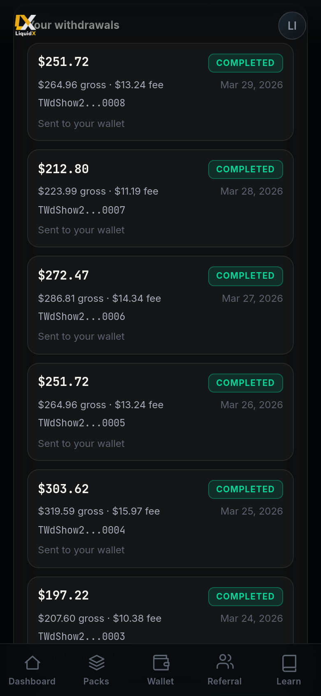
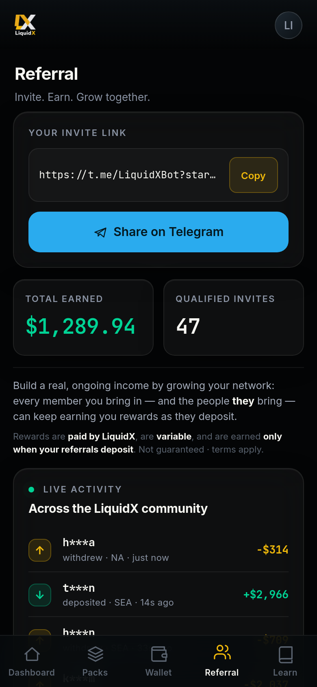

---
cover: ../.gitbook/assets/gitbook-cover.png
coverY: 0
---

# Quick Start

This page explains the basic LiquidX journey from first open to dashboard tracking.

Read the risk pages before depositing. Do not allocate emergency money or money you cannot afford to lose.

## 1. Open the official Telegram Mini App

Start only from the official LiquidX bot: **[@LiquidX_official_bot](https://t.me/LiquidX_official_bot)**.

Check the handle carefully. LiquidX will never send you a private message first asking for funds, seed phrases, private keys, or personal wallet transfers.

## 2. Deposit USDT

Inside the app, choose the supported deposit option and send USDT only to the address and network shown in the official interface.

Before sending, verify:

* Network.
* Address.
* Amount.
* Wallet source.
* Any displayed instructions.

Deposits may require network confirmations and internal security checks before the dashboard updates.

## 3. Choose a tier

After funding, choose a liquidity tier.

Tiers are simple allocation levels. They are not guaranteed-return products. The available tiers are:

| Tier | Min. Deposit | Rate (approx.) |
|---|---:|---:|
| Platinum | $500 | ≈36%/mo |
| Diamond | $1,500 | ≈40%/mo |
| Captain | $5,000 | ≈44%/mo |
| Ambassador | $15,000 | ≈47%/mo |
| VIP | $50,000 | ≈50%/mo |

Rates are variable, set from last month's average. Captain, Ambassador, and VIP tiers require qualified invites to unlock. See [Allocation Tiers](../product/allocation-tiers.md) for full details.

## 4. Allocation starts

After pack selection, capital may enter internal liquidity routes, managed pools, or vaults.

These structures can support liquidity activity such as OTC flow, crypto market liquidity, stablecoin movement, market-making activity, commodities-related liquidity needs, and internal liquidity balancing.

## 5. Track your dashboard

The dashboard should help users track:

* Deposits and selected pack.
* Current allocation status.
* Balance and projected performance.
* Activity history.
* Referral rewards.
* Withdrawal status.

<figure><figcaption>Your dashboard — track balance, allocation, performance and referrals in real time.</figcaption></figure>

Projections are for transparency. They are not promises.

## 6. Request withdrawals

Users can request withdrawals inside the app.

Withdrawals may depend on pack rules, lock periods, vault cycles, liquidity availability, processing windows, security checks, and network conditions.

<figure><figcaption>Withdrawal screen — verify your address and network carefully before confirming.</figcaption></figure>

## 7. Invite real users

Every user can invite others through referral.

Referral rewards are based on real deposit activity, not fake accounts, bots, or giveaway traffic. Good referrers educate users before they allocate.

<figure><figcaption>Referral screen — share your link and track invited users and rewards.</figcaption></figure>

---

*Capital at risk. Performance variable. Not financial advice. Official bot: [@LiquidX_official_bot](https://t.me/LiquidX_official_bot)*
